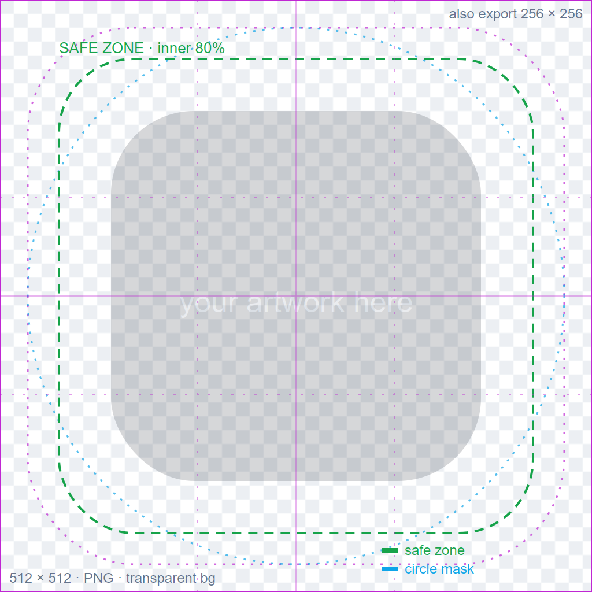

# Extension logo guidance

Every extension gets a **logo** (shown on its Marketplace card and, when
featured, as an illustrated cover). Follow this spec so logos look consistent
and stay crisp on both light and dark card backgrounds.

## Download the template

- [`extension-logo-template.svg`](./extension-logo-template.svg) — open in
  Figma / Illustrator / Inkscape, drop your artwork on the artboard, keep key
  detail inside the **safe zone**, hide the guides layer, export.
- [`extension-logo-template.png`](./extension-logo-template.png) — same guides
  as a flat reference image.



## Spec

| Property | Value |
|---|---|
| **Canvas** | **512 × 512 px** (square). Also export a **256 × 256** copy for the panel cover. |
| **Format** | **PNG** with a **real transparent background** — no baked color, no "checkerboard" pattern flattened into the image. |
| **Safe zone** | Keep essential detail inside the **inner 80%** (the green dashed box). The panel may round the corners or clip to a circle. |
| **Bleed** | Artwork may extend toward the edges, but avoid important detail in the outer ~8%. |
| **Rounded mask** | Cards can round corners at ~18% radius (magenta guide). Nothing critical in the very corners. |
| **Circle mask** | Some surfaces clip to a circle (blue guide). The logo should still read when circular. |
| **Contrast** | Works on **both** light and dark backgrounds. If your mark is dark, give it a light container (like the Faro cover); if light, a dark one. |
| **Style** | A recognizable 3D/illustrated cover reads best for featured extensions; a flat brand mark is fine otherwise. |

## Transparency, the common trap

AI image tools (and screenshots) often produce a **flattened** background — a
solid color, or a gray "checkerboard" that only *looks* transparent. That is
**not** a transparent PNG. Verify before shipping:

```bash
python -c "from PIL import Image; a=Image.open('logo.png').convert('RGBA').getchannel('A'); print('alpha min/max', a.getextrema())"
# transparent → (0, 255).  Fully opaque (baked bg) → (255, 255).
```

If it comes back `(255, 255)`, key out the background first. A **solid, saturated
key color** (e.g. bright purple `#8B04FC`) chroma-keys far more cleanly than a
gray or checkerboard fill — generate the art on that, then remove it.

## Publishing

Put the logo in this repo at `assets/<slug>/logo.png` and reference it from your
`index.json` entry as `"logo": "assets/<slug>/logo.png"` (the panel rewrites it
to a raw URL). For an illustrated **featured** cover bundled into the panel, see
`frontend/src/components/icons/ExtensionIcons.js` in the ServerKit repo.
`serverkit-faro` is a worked example of all of the above.
